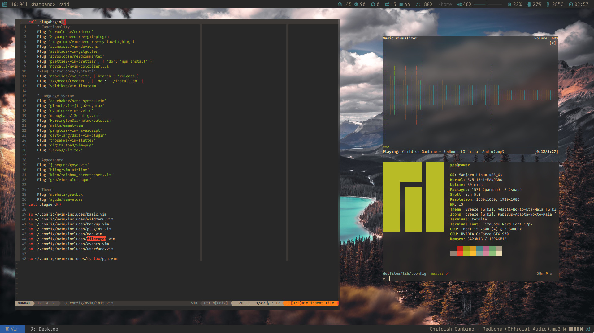

# dotfiles

**NOTE: The setup will only run correctly if run from inside the repository dir. Use [this script](https://github.com/Kruhlmann/dotfiles/blob/master/lib/.scripts/update_dotfiles) to run it from anywhere.**

It is included in the path as `update_dotfiles` please check the path it's using beforehand.



## Setup

*These dotfiles used to support i3 and dwm, but are now being used with xmonad. They may still prove useful for an these other WMs, but these files are not being maintained!*

To import these dotfiles run the following commands:

```sh
git clone https://github.com/Kruhlmann/dotfiles
cd dotfiles
chmod +x setup
./setup
```

Backups of included files are stored in the [back](back) folder corresponding
to their path from `$HOME` (`~/.config/nvim/init.vim` is saved under
`./back/.config/nvim/init.vim`).

## Scripts

### Data manipulation

* `calimport` Allows importing ICS calendar files into calcurse.
* `calparse` Parser for `calimport`.
* `msgx` MSG file converter.

### Status bars

* `active_gitlab_merge_requests` Number of my active merge requests at work.
* `bluetooth` Current bluetooth state.
* `corona` Corona stats.
* `mpd_progress` MPD progress line.
* `mpd_status` MPD playing status.
* `nextapt` Next appointment from calcurse.
* `pacman_packages` Pacman updates available.
* `peripherals` Mouse and headset battery status.
* `thermals` CPU/Nvidia GPU temperature.
* `transwttrico` Translate weather icon to nerdfont from unicode.
* `unread_mail` Number of unread mails.
* `weather` Current weather forecast.
* `xmonad_workspaces`

#### DWM

* `dwmbar` Starts DWM bar
* `dwm_mpd` MPD wrapper
* `dwm_calcurse` Calcurse wrapper
* `dwm_clock` Clock
* `dwm_corona` Corona wrapper
* `dwm_cputemp` CPU temperature wrapper
* `dwm_mail` E-mail wrapper

#### i3blocks

* `battery` Battery status.
* `bluetooth` Bluetooth status.
* `clock` Clock.
* `cpu` CPU usage.
* `disk` Disk usage.
* `internet` Internet connection status.
* `iplocate` IP location.
* `mailbox` Unread mails.
* `memory` Memory usage.
* `music` MPD status.
* `newsboat` RSS feed status.
* `pacpackages` Number of available packages.
* `torrent` Torrent count.
* `volume` Volume meter.
* `vpn` VPN status.

### Clipboard

* `cbp` Uses xdotool to send the content of the clipboard to a window.
* `cpimg` Copies the contents of an image to the clipboard.

### Synchronization

* `synccal` Synchronize calendar with git.
* `syncmail` Synchronize mailbox.
* `sync_music` Synchronize music with YouTube.
* `update_dotfiles` Synchronizes dotfiles.

### Qutebrowser

* `qute-bitwarden` Bitwarden rofi menu.
* `qute-goyo` Reader mode.

### Audio

* `mute_mic` Mutes the default pulseaudio input.
* `unmute_mic` Unmutes default pulseaudio input.

### Uncategorized

* `aur` Fuzzy-find AUR packages.
* `aur-rm` Fuzzy-find uninstall AUR packages.
* `colortest` Prints a pre-set array of colors to the console.
* `devour` Replaces the terminal window with an X window whiel active.
* `dmenu_apps` Dmenu application launcher.
* `emoji_commit_selector` Create a commit message with an emoji prefix
* `fmt_ical_desc` Formates the description in an ICS file for calcurse.
* `fzmp` Fuzzy-find MPC tracks.
* `get_ad_certs` Retrieve Active Directory certificates.
* `get_certs` Retrieve machine certificates.
* `launch_polybar` Restarts polybar.
* `maimpick` Maim shortcut for area to clipboard screenshot.
* `mount_drive` Mounts a drive with dmenu.
* `neomutt_mailbox` Rofi menu for opening neomutt mailbox.
* `notify_mail` Notifies of new mails.
* `playdf` Launches dwarf fortress
* `progress` Shows progress bar.
* `prompt` Dmenu prompt
* `run_scaled` Run scaled X window application.
* `se` Edit scripts and config file.
* `show_git_emoji_selection` Helper for `emoji_commit_selector`.
* `sr` Run script or config file.
* `stmux` Open a TMUX workspace configured in [tmux-blueprints](./lib/.config/tmux-blueprints)
* `swedify` Converts text into "Svidish".
* `transadd` Add torrent to transmission.
* `twitch` Play Twitch stream with streamlink.
* `umount_drive` Unmount drive with dmenu.
* `vcal` Browse calcurse from CLI.
* `verify_qtile_config` Verifies QTile configuration.
* `wifi` Connect to wifi network.
