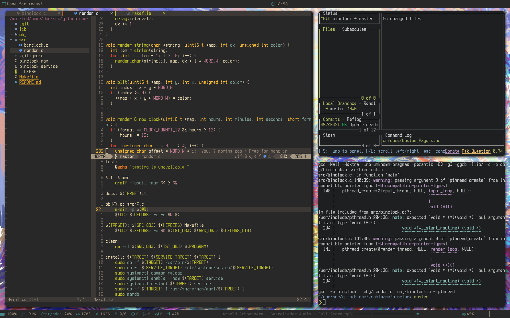

# dotfiles

**NOTE: The setup will only run correctly if run from inside the repository dir. Use [this script](https://github.com/Kruhlmann/dotfiles/blob/master/lib/.scripts/update_dotfiles) to run it from anywhere.**

It is included in the path as `update_dotfiles` please check the path it's using beforehand.



## Setup

*These dotfiles used to support i3 and dwm, but are now being used with xmonad. They may still prove useful for an these other WMs, but these files are not being maintained!*

To import these dotfiles run the following commands:

```sh
git clone https://github.com/Kruhlmann/dotfiles
cd dotfiles
./install
```

Backups of included files are stored in the [back](back) folder corresponding
to their path from `$HOME` (`~/.config/nvim/init.vim` is saved under
`./back/.config/nvim/init.vim`).
